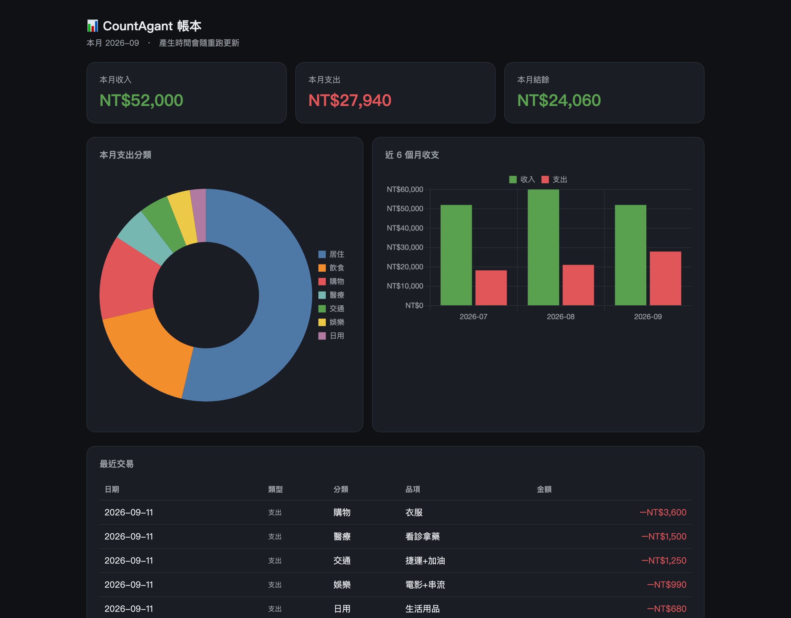

# CountAgent

[繁體中文](README.zh-TW.md)

**A personal expense tracker that runs inside Claude Code. The capture side is deliberately stupid; every judgement call is handed to the agent.**

Say "lunch 120" to Siri while you're still standing outside the shop. Say "sort it out" when you're back at your computer. Categorising, filling in the blanks, working out the budget and writing the reports all happen afterwards, without you.



<sub>Produced by <code>python3 scripts/dashboard.py --demo</code>. Every number in the screenshot is demo data.</sub>

This runs on your own machine, so there is nothing hosted to click. The closest thing to a live demo is one command — no ledger, no account, no setup:

```bash
git clone https://github.com/seanlu2006/CountAgent.git
cd CountAgent
python3 scripts/dashboard.py --demo
```

## Why I built it

Expense apps are everywhere, and I've quit every one of them inside two weeks. The problem was never the feature list. It was **the two seconds at the point of spending**: open the app, wait for it to load, pick a category, pick a payment method, fill in the fields. Every entry asks you to tidy up the data on the app's behalf first. Standing in a doorway, in the rain, halfway through a conversation, nobody wants to do that.

So I didn't try to build a better expense app. I asked a different question: **what if recording an expense collapsed into one spoken sentence, and everything clever happened afterwards?**

## The idea: move the intelligence out of the interface and into the agent

A normal expense app puts its intelligence in the **interface** — dropdowns, category trees, tags, rule engines. The price is that you have to think in the shape of the database schema. You aren't recording an expense; you're populating a table.

CountAgent splits capture from interpretation completely:

| | Capture | Interpretation |
|---|---|---|
| Where | iPhone, anywhere | Computer, whenever |
| Who | You, one sentence, two seconds | The agent, unattended |
| How smart | **As dumb as possible** — append plain text to a file | **Smart** — semantic parsing and common sense |
| Failure rate | Near zero; works with no signal | Higher, but every mistake is fixable later and none of them block capture |

**The dumb capture side is a design decision, not laziness.** It does exactly one thing: append a line of text to a plain text file. No fields, no menus, no login, no network request. Too dumb to break — and too dumb to give me an excuse not to use it.

**All the tedious judgement calls go to the agent.** Turning "late-night snack 97, yesterday" into a nine-column row means inferring the date (which day was "yesterday"), the type, the category (a snack counts as Food) and the payment method (unstated, so the default applies) — and then writing a short description. That is exactly where an LLM is strong and where a keyword-matching rule engine is most brittle — a keyword table never covers the way people actually talk.

**And the rules are prose, not code.** The agent's entire behaviour is defined in [`CLAUDE.md`](CLAUDE.md): 164 lines, about 8.5 KB of Traditional Chinese. It covers how to infer a category, when to stop and ask instead of guessing, why an investment is neither income nor expense, and which suspicious categories to re-check after an invoice import. Translated, the rules read like this:

> If he doesn't say how he paid, default to credit card — he rarely uses cash. "Paid cash" means cash; LINE Pay, JKOPay or EasyWallet means mobile payment; a transfer, a remittance or a repayment means bank or transfer.

> Invoice categories are guessed from the shop name and may be wrong. After an import, go through the doubtful ones yourself — something bought at a convenience store isn't necessarily Food — and ask once whether to adjust them; when he confirms, drop the "category unconfirmed" marker from the note.

Changing a rule means editing a sentence, not rewriting a parser. The rules can drift with my habits instead of with my willingness to touch the code.

The practical difference: recording an expense goes from "open app → pick category → type amount → save" to "say one sentence to Siri", and sorting it out goes from "never" to "say 'sort it out' when I have a minute".

## What it does

- **One-sentence capture** — an iOS Shortcut plus Siri appends one line to `inbox.txt` in iCloud. It works offline, and if you set the Shortcut up to prepend a timestamp, the agent uses that as the date.
- **Semantic entry** — the agent reads the backlog line by line, infers the date, the type, the category and the payment method, writes a short description, and appends a nine-column row to the ledger.
- **Duplicate protection** — iCloud sync can hand back lines that were already processed, so every raw line is kept in an archive file and compared verbatim; anything already seen is skipped.
- **E-invoice import** — in Taiwan, purchases can be attached to a phone-barcode carrier and retrieved later. Two routes, one ledger: a CSV export from the carrier app (column names matched by keyword, comma or tab, Big5 and UTF-8 both decoded automatically) or the Ministry of Finance carrier API. Both deduplicate on invoice number.
- **Reports** — a monthly summary, a quarterly statement (savings rate, budget vs actual, fixed vs variable spending) and an HTML dashboard.
- **Cooking cost tracking** — records how fast ingredients get used up, so I can compare what cooking actually costs per meal against what eating out costs.

## Quick start

You need [Claude Code](https://claude.com/claude-code) and Python 3. The scripts use the standard library only — **nothing to `pip install`**.

```bash
git clone https://github.com/seanlu2006/CountAgent.git
cd CountAgent
```

**See what it looks like first.** This uses built-in fake data and never reads your ledger — it does overwrite `reports/dashboard.html`, so re-run it without `--demo` afterwards if you already have a real one:

```bash
python3 scripts/dashboard.py --demo
```

**Then set up your own files.** Copy the templates — all four are already excluded by `.gitignore`:

```bash
cp data/ledger.example.csv    data/ledger.csv        # the ledger itself
cp data/budget.example.md     data/budget.md         # budget, read by the quarterly report
cp data/profile.example.md    data/sean_profile.md   # your defaults: payment habits, fixed costs
cp data/food_notes.example.md data/food_notes.md     # ingredient costs (optional)
```

The numbers in the templates are invented, so replace them. Then open Claude Code in the project folder:

```bash
claude
```

and talk to it. **Recording an expense takes no command at all:**

> **You:** lunch 120
>
> **Agent:** ✅ #42 2026-05-31 | expense 120 | Food · lunch (credit card)

The agent works in Traditional Chinese; the reply above is translated. It checks the iCloud inbox at the start of every session; saying "sort it out" just tells it to digest the whole backlog now.

**Reports:**

```bash
python3 scripts/report.py                 # this month, printed to the terminal
python3 scripts/report.py 2026-08         # a specific month
python3 scripts/quarterly.py              # this quarter
python3 scripts/quarterly.py 2026Q3       # a specific quarter
python3 scripts/quarterly.py 2026Q3 --md  # also saved to reports/2026-Q3.md
python3 scripts/dashboard.py              # reports/dashboard.html, opened on macOS
python3 scripts/dashboard.py --no-open    # the same file, without opening a browser
```

**E-invoice import:**

```bash
python3 scripts/import_csv.py export.csv --dry-run   # preview, write nothing
python3 scripts/import_csv.py export.csv
```

For the Ministry of Finance carrier API, copy `data/secrets.example.json` to `data/secrets.json`, fill in your credentials, then:

```bash
python3 scripts/fetch_invoices.py --days 30 --dry-run
```

**Setting up the Siri capture side** is optional, but it's the point of the whole design. In the iOS Shortcuts app, create a shortcut with a single action: "Append to Text File". Point it at `inbox.txt` in the Shortcuts iCloud folder, and set the content to a timestamp followed by the dictated text (the timestamp has to come first for the agent to read it as the date). Give it a name you can say out loud. iCloud syncs the file to the Mac on its own.

## How it works

```
[capture]  one sentence to Siri on the iPhone
    └─▶ appended to inbox.txt in iCloud (plain text, one line per entry, timestamped)
               │  iCloud syncs it across
               ▼
[parse]    the Claude Code agent reads inbox.txt
    ├─▶ compares each raw line against inbox_archive.txt and skips duplicates
    └─▶ interprets the rest line by line against the rules in CLAUDE.md
               │
[classify] category inferred from categories.md; payment method filled in from the profile defaults
               │
[store]    one row appended to data/ledger.csv (nine columns; history is never reordered)
               │  inbox emptied, raw lines moved into the archive
               ▼
[report]   report.py     — month, prints to the terminal
           quarterly.py  — quarter, reads budget.md; --md also writes reports/<YYYY>-Q<N>.md
           dashboard.py  — writes reports/dashboard.html

The other way in:
carrier CSV / Ministry of Finance API ─▶ categorize.py guesses a category from the shop name ─▶ the same ledger.csv
                                         (flagged "category unconfirmed" for the agent to review later)
```

`ledger.csv` is the single source of truth: plain CSV. It opens in Excel, it's trivial to back up or migrate, and it's tied to no app and no database.

## Project layout

```
CountAgent/
├── CLAUDE.md                    # agent behaviour definition — the core of this project, written as prose
├── data/
│   ├── categories.md            # category definitions (public)
│   ├── ledger.example.csv       # ledger template (fake data)
│   ├── budget.example.md        # budget template (fake data)
│   ├── profile.example.md       # personal defaults template (fake data)
│   ├── food_notes.example.md    # ingredient cost template (fake data)
│   └── secrets.example.json     # invoice API credentials template
├── scripts/
│   ├── report.py                # monthly summary
│   ├── quarterly.py             # quarterly statement (reads budget.md)
│   ├── dashboard.py             # HTML dashboard (Chart.js from a CDN)
│   ├── import_csv.py            # e-invoice CSV import
│   ├── fetch_invoices.py        # Ministry of Finance carrier API
│   └── categorize.py            # shop name → category, shared by both import paths
├── docs/dashboard.png           # the screenshot above
└── reports/                     # generated reports (not in version control)
```

The real ledger, budget, profile and reports are all outside version control. A clone gives you the code, the behaviour definition and fake sample data — nothing else. `data/` is deny-by-default in `.gitignore`, with an allowlist for the templates, so a private file added there later can't leak into a commit just because I forgot to add a rule for it.

## Known limitations

- **It depends on Claude Code.** This is not a standalone app. Without Claude Code you're left with a few Python scripts that read a CSV, and the bookkeeping half doesn't run at all.
- **The LLM doesn't get everything right.** Genuinely ambiguous lines ("that 300") are left in the inbox for me to confirm rather than guessed at. E-invoice categories are **guessed from the shop name**, so household goods bought at a convenience store land under Food and need a review pass.
- **One person, one machine.** It leans on iCloud file sync: no shared ledgers, no real-time multi-device sync. Sync lags, and it can hand back old lines — which is what the archive comparison is there for.
- **Capture is tied to Apple.** Siri plus an iOS Shortcut writing to an iCloud file. On another platform you'd have to build your own "append one line to a file" capture, but that is genuinely all it is; the layer was designed to be that thin.
- **The Ministry of Finance API needs an AppID**, and the application page is often down for maintenance, so CSV import is the route I actually use.
- **The dashboard needs a network connection for its charts.** It pulls Chart.js from a CDN; offline you still get the KPI cards and the transactions table, just not the two charts.
- **Fixed vs variable spending is manual.** The quarterly report counts a row as fixed only if its note contains the Chinese word 固定 ("fixed") — a literal keyword match in `quarterly.py` — so an unlabelled recurring bill shows up as variable.

## License

[MIT](LICENSE). Take it, change it, use it.
